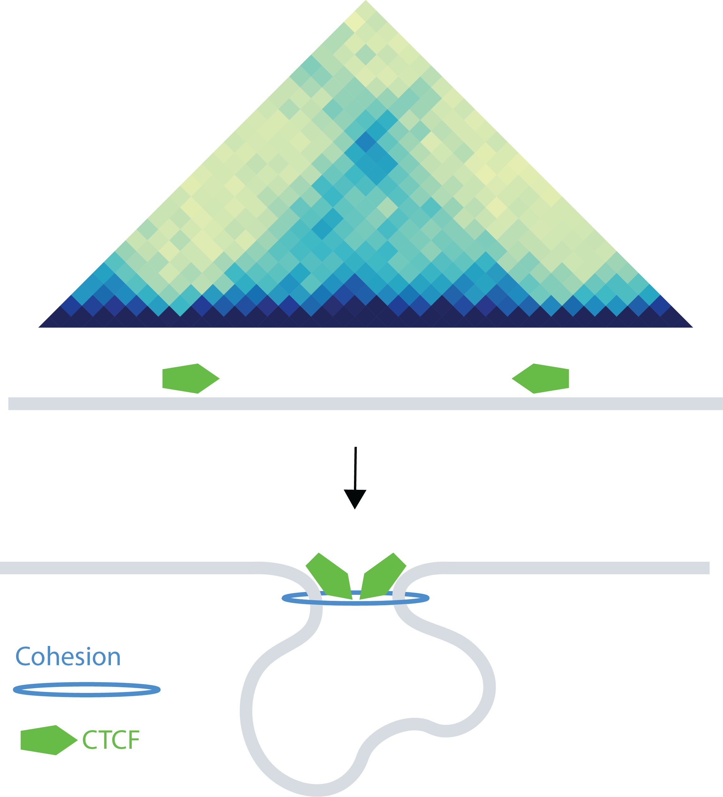
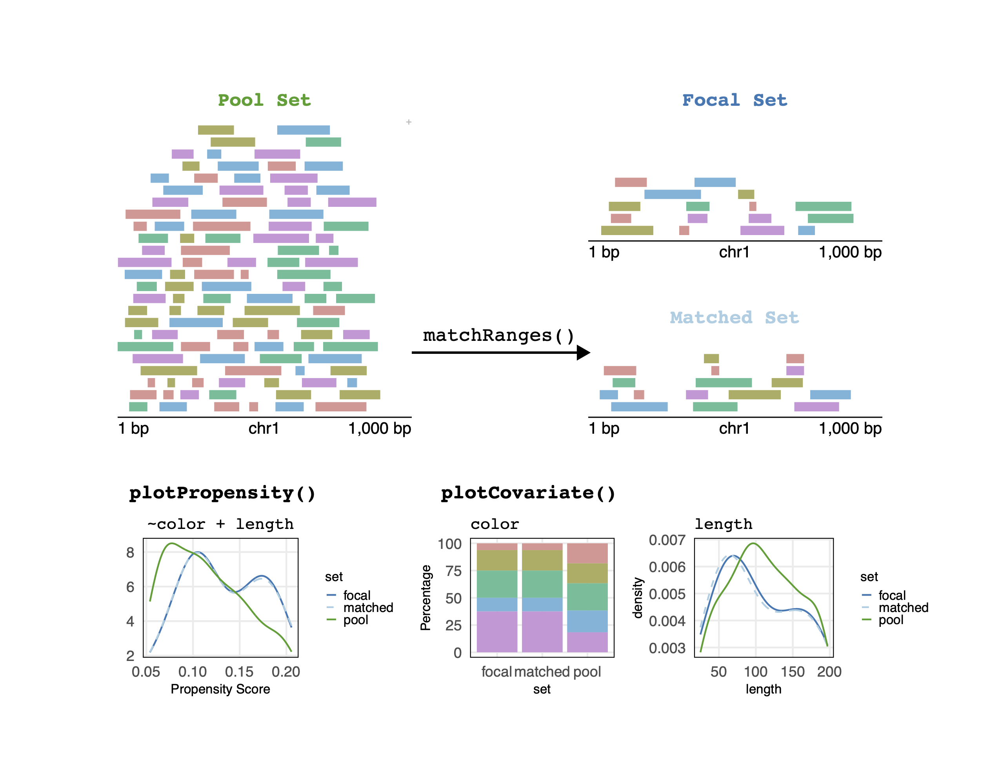

```{r, include = FALSE}
knitr::opts_chunk$set(
  collapse = TRUE,
  comment = "#>"
)
```

## Overview

### Description

The nullranges package contains functions for generation of feature sets
(genomic regions) for exploring the null hypothesis of overlap or
colocalization of two observed feature sets. The package has two
approaches for generating null feature sets, *matching* and
*bootstrapping*:
    
* Matched subsampling with matchRanges:

    Subsampling from a pool of features, but controlling for certain
    characteristics.

* Bootstrapping with bootRanges:
    

In this workshop, we will demonstrate the two major approaches for
generating null hypothesis genomic ranges with the `nullranges`
package.

### Background and other methods

Suppose we want to examine the significance of overlaps
of genomic sets of features $x$ and $y$. To test the significance of
this overlap, we calculate the overlap expected under the null by
generating a null feature set $y'$ (potentially many times). The null
features in $y'$ may be characterized by:

1. Drawing from a larger pool $z$ ($y' \subset z$), such that $y$ and
   $y'$ have a similar distribution over one or more covariates. This
   is the "matching" case. Note that the features in $y'$ are original
   features, just drawn from a different pool than y.
2. Generating a new set of genomic features $y'$, constructing them
   from the original set $y$ by selecting blocks of the genome with
   replacement, i.e. such that features can be sampled more than once.
   This is the "bootstrapping" case. Note that, in this case, $y'$ is an
   artificial feature set, although the re-sampled features can retain
   covariates such as score from the original feature set $y$.
   
#### In other words

1. Matching -- drawing from a pool of features but controlling for 
   certain characteristics
2. Bootstrapping -- placing a number of artificial features in the 
   genome but controlling for their spatial distribution


### Releated work

For general considerations of generation of null feature sets or
segmentation for enrichment or colocalization analysis, consider the
papers of @de_2014, @haiminen_2007,
@huen_2010, and @kanduri_2019 (with links in references below).
Other Bioconductor packages that offer randomization techniques for 
enrichment analysis include:
[MatchIt](https://cran.r-project.org/web/packages/MatchIt/vignettes/MatchIt.html)
[LOLA](https://bioconductor.org/packages/LOLA) [@LOLA] and 
[regioneR](https://bioconductor.org/packages/regioneR) [@regioneR]. 
Methods implemented outside of Bioconductor include 
[GAT](https://github.com/AndreasHeger/gat) [@GAT],
[GSC](https://github.com/ParkerLab/encodegsc) [@bickel_2010],
[GREAT](http://bejerano.stanford.edu/great/public/html/) [@GREAT],
[GenometriCorr](https://github.com/favorov/GenometriCorr) [@GenometriCorr],
or [ChIP-Enrich](http://chip-enrich.med.umich.edu/) [@ChIP-Enrich].
We note that our block bootstrapping approach closely follows that of 
[GSC](https://github.com/ParkerLab/encodegsc), while offering
additional features/visualizations, and is re-implemented within
R/Bioconductor with efficient vectorized code for operation on 
*GRanges* objects [@granges].

### Pre-requisites

* Some basic familiarity with *GenomicRanges* objects.

### Background reading

* [Subsampling Methods for Genomic Inference](https://doi.org/10.1214/10-%7BAOAS363%7D)
* [Matching as Nonparametric Preprocessing for Reducing Model Dependence in Parametric Causal Inference](https://doi.org/10.1093/pan/mpl013)

### Participation

The format is lecture + lab, with time for data exploration.

### _R_ / _Bioconductor_ packages used

* GenomicRanges
* plyranges

### Time outline

An example for a 45-minute workshop:

| Activity                      | Time |
|-------------------------------|------|
| Intro to nullranges           | 5m   |
| Matching with matchRanges     | 15m  |
| Bootstrapping with bootRanges | 15m  |
| Q&A                           | 10m  |

### Workshop goals and objectives

### Learning goals

* Understand matching vs bootstrapping for nullranges
* Using matchRanges to generate covarite-matched subsets
* Using bootRanges to generate block bootstrapped ranges
* Integrating nullranges with plyranges

### Learning objectives

* matchRanges
    * Generate matched null sets of GenomicRanges
    * Assess quality of matching
    * Compare biological results
* bootRanges


## Matching covariates with matchRanges

The following content is an excerpt from the vignette
[Case study I: CTCF occupancy](https://nullranges.github.io/nullranges/articles/matching_granges.html) from the nullranges package.

In this vignette we demonstrate generating covariate-matched,
null-hypothesis GRanges using the `matchRanges()` function to test for
the occupancy of CCCTC-binding factor (CTCF) at chromatin loop
anchors. 

### Biological background

One of the fundamental principles of chromatin-looping suggests that
most loops are bound at both ends by the CTCF transcription factor
(TF). CTCF-bound loops can be formed by loop-extrusion, where the
ring-like cohesin complex extrudes chromatin until stopped by bound
CTCF. By this mechanism, we expect most loop anchors will be bound by
CTCF. 

```{r, echo=FALSE, fig.alt="CTCF-bound DNA Looping"}

```

While we could test this hypothesis by simple overlap or permutation
testing, these approaches fail to account for non-uniformly
distributed covariate genomic features. For example, loop anchors are
commonly bound by CTCF and located in open chromatin regions. We can
use `matchRanges()` to test for CTCF occupancy at loop anchors
controlling for open chromatin regions. 

Here, we generate a set of null-hypothesis GRanges to more rigorously
test CTCF occupancy at loop anchors independently from open chromatin
regions. We use the `hg19_10kb_bins` dataset from the
`nullrangesData` package, which contains ranges for every 10Kb bin
along the genome with CTCF, DNase, and loop feature annotations from
GM12878 (see `?nullrangesData::hg19_10kb_bins`). 

```{r, echo=FALSE, fig.alt="Overview of MatchGRanges"}

```

### Matching with `matchRanges()`

Before we generate our null ranges, let's take a look at our example dataset:

```{r, message=FALSE, warning=FALSE}
library(nullrangesData)

## Load example data
bins <- hg19_10kb_bins()

bins
```

`matchRanges()` works by selecting a set of covariate-matched controls
from a pool of options based on an input focal set of interest. Here,
we define `focal` as bins that contain a loop anchor, `pool` as bins
that don't contain a loop anchor, and `covar` as DNase signal and
number of DNase sites per bin: 

```{r}
library(nullranges)

## Match ranges
set.seed(123)
mgr <- matchRanges(focal = bins[bins$looped],
                   pool = bins[!bins$looped],
                   covar = ~dnaseSignal + n_dnase_sites)
mgr
```

When the focal and pool arguments are `GRanges` objects,
`matchRanges()` returns a `MatchedGRanges` object. The
`MatchedGRanges` class extends `GRanges`, so all of the same
operations can be applied: 

```{r, message=FALSE, warning=FALSE}
library(GenomicRanges)
library(plyranges)
library(ggplot2)

## Summarize ctcfSignal by n_ctcf_sites
mgr %>%
  group_by(n_ctcf_sites) %>%
  summarize(ctcfSignal = mean(ctcfSignal)) %>%
  as.data.frame() %>%
  ggplot(aes(x = n_ctcf_sites, y = ctcfSignal)) +
    geom_line() +
    geom_point()
```

Here, we utilize
the [`plyranges` package](https://sa-lee.github.io/plyranges/) which
provides a set of "tidy" verbs for manipulating genomic ranges for a
seamless and integrated genomic analysis workflow. 

### Assessing quality of matching

We can get a quick summary of the matching quality with `overview()`:

```{r}
overview(mgr)
```

For continuous covariates (such as `dnaseSignal`), `overview()` shows
the mean and standard deviation between each matched set. For
categorical covariates, such as `n_dnase_sites`, `overview()` reports
the number of observations per category and matched set. The bottom
section shows the mean and s.d (or n, for factors) difference between
focal and matched sets. 

`overview()` also summarizes the propensity scores for each set to
give a quick idea of overall matching quality. 

#### Visualizing matching results

Let's visualize overall matching quality by plotting propensity scores
for the focal, pool, and matched sets: 

```{r, message=FALSE}
plotPropensity(mgr, sets = c('f', 'p', 'm'), type = 'ridges')
```

From this plot, it is clear that the matched set is much closer to the focal set than the pool set.

We can ensure that covariate distributions have been matched
appropriately by using the `covariates()` function to extract matched
covariates along with `patchwork` and `plotCovarite` to visualize all
distributions: 

```{r, message=FALSE, warning=FALSE, fig.height=6, fig.width=5}
library(patchwork)
plots <- lapply(covariates(mgr), plotCovariate, x=mgr, sets = c('f', 'm', 'p'))
Reduce('/', plots)
```

### Compare CTCF sites

Using our matched ranges, we can compare CTCF occupancy in bins that
1) contain a loop anchor (i.e. looped), 2) don't contain a loop anchor
(i.e. unlooped), or 3) don't contain a loop anchor, but are also
matched for the strength and number of DNase sites (i.e. matched). In
this case, we calculate CTCF occupancy as the percent of bins that
contain CTCF among our 3 sets by using the `focal()` and `pool()`
accessor functions: 

```{r fig.width=4.5, fig.height=5}
## Percent of bins with CTCF
g1 <- (sum(focal(mgr)$n_ctcf_sites >= 1) / length(focal(mgr))) * 100
g2 <- (sum(pool(mgr)$n_ctcf_sites >= 1) / length(pool(mgr))) * 100
g3 <- (sum(mgr$n_ctcf_sites >= 1) / length(mgr)) * 100

## Visualize
barplot(height = c(g1, g2, g3),
        names = c('looped\n(focal)', 'unlooped\n(pool)', 'unlooped\n(matched)'),
        ylab = "CTCF occupied bins (%)",
        col = c('#1F78B4', '#33A02C', '#A6CEE3'),
        main = 'CTCF occupancy',
        border = NA,
        las = 1)
```


## Block bootstrapping with bootRanges


## Additional references
