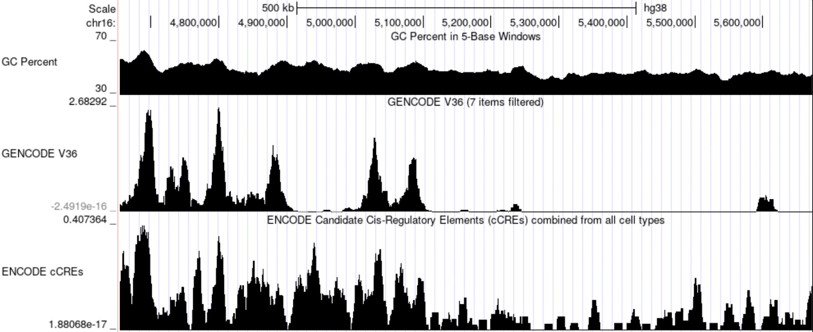
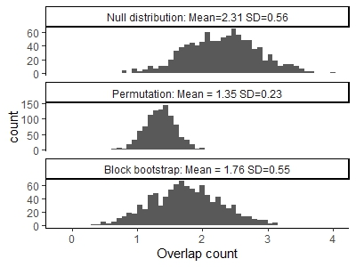
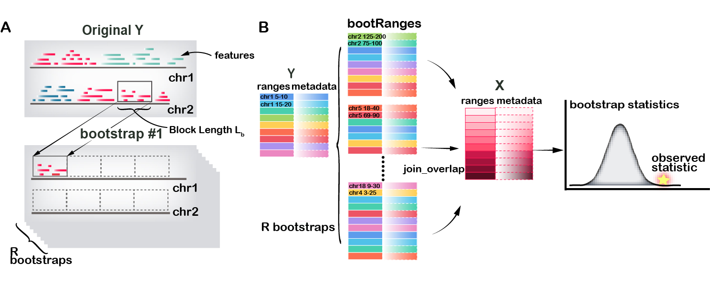
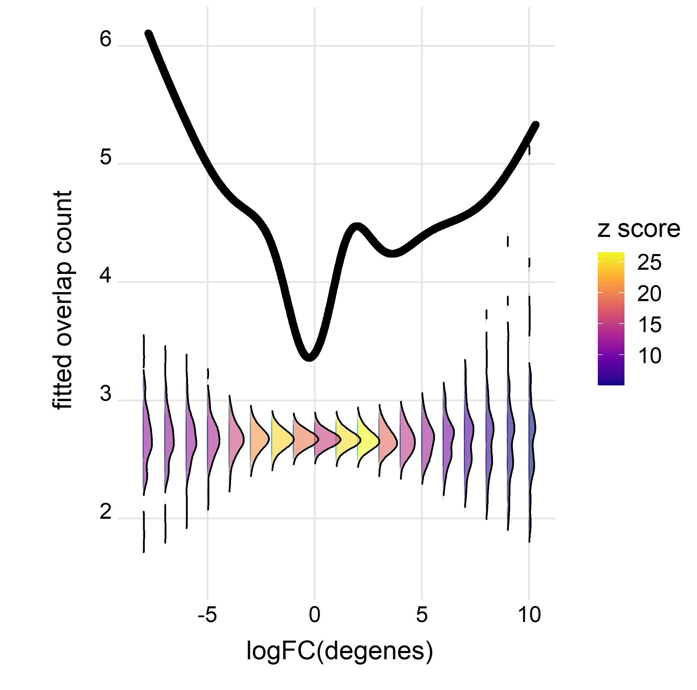

```{r, include = FALSE}
knitr::opts_chunk$set(
  collapse = TRUE,
  comment = "#>"
)
```

## Overview

### Description

The nullranges package contains functions for generation of feature sets
(genomic regions) for exploring the null hypothesis of overlap or
colocalization of two observed feature sets. The package has two
approaches for generating null feature sets, *matching* and
*bootstrapping*:
    
* Matched subsampling with matchRanges:

    Subsampling from a pool of features, but controlling for certain
    characteristics.

* Bootstrapping with bootRanges:
    
    Sampling large blocks of features within the segments from the original set
with replacement.

In this workshop, we will demonstrate the two major approaches for
generating null hypothesis genomic ranges with the `nullranges`
package.

### Background and other methods

Suppose we want to examine the significance of overlaps
of genomic sets of features $x$ and $y$. To test the significance of
this overlap, we calculate the overlap expected under the null by
generating a null feature set $y'$ (potentially many times). The null
features in $y'$ may be characterized by:

1. Drawing from a larger pool $z$ ($y' \subset z$), such that $y$ and
   $y'$ have a similar distribution over one or more covariates. This
   is the "matching" case. Note that the features in $y'$ are original
   features, just drawn from a different pool than y.
2. Generating a new set of genomic features $y'$, constructing them
   from the original set $y$ by selecting blocks of the genome with
   replacement, i.e. such that features can be sampled more than once.
   This is the "bootstrapping" case. Note that, in this case, $y'$ is an
   artificial feature set, although the re-sampled features can retain
   covariates such as score from the original feature set $y$.
   
#### In other words

1. Matching -- drawing from a pool of features but controlling for 
   certain characteristics
2. Bootstrapping -- placing a number of artificial features in the 
   genome but controlling for their spatial distribution


### Releated work

For general considerations of generation of null feature sets or
segmentation for enrichment or colocalization analysis, consider the
papers of @de_2014, @haiminen_2007,
@huen_2010, and @kanduri_2019 (with links in references below).
Other Bioconductor packages that offer randomization techniques for 
enrichment analysis include:
[MatchIt](https://cran.r-project.org/web/packages/MatchIt/vignettes/MatchIt.html)
[LOLA](https://bioconductor.org/packages/LOLA) [@LOLA] and 
[regioneR](https://bioconductor.org/packages/regioneR) [@regioneR]. 
Methods implemented outside of Bioconductor include 
[GAT](https://github.com/AndreasHeger/gat) [@GAT],
[GSC](https://github.com/ParkerLab/encodegsc) [@bickel_2010],
[GREAT](http://bejerano.stanford.edu/great/public/html/) [@GREAT],
[GenometriCorr](https://github.com/favorov/GenometriCorr) [@GenometriCorr],
or [ChIP-Enrich](http://chip-enrich.med.umich.edu/) [@ChIP-Enrich].
We note that our block bootstrapping approach closely follows that of 
[GSC](https://github.com/ParkerLab/encodegsc), while offering
additional features/visualizations, and is re-implemented within
R/Bioconductor with efficient vectorized code for operation on 
*GRanges* objects [@granges].

### Pre-requisites

* Some basic familiarity with *GenomicRanges* objects.

### Background reading

* [Subsampling Methods for Genomic Inference](https://www.jstor.org/stable/23362444)
* [Matching as Nonparametric Preprocessing for Reducing Model Dependence in Parametric Causal Inference](https://doi.org/10.1093/pan/mpl013)

### Participation

The format is lecture + lab, with time for data exploration.

### _R_ / _Bioconductor_ packages used

* GenomicRanges
* plyranges

### Time outline

An example for a 45-minute workshop:

| Activity                      | Time |
|-------------------------------|------|
| Intro to nullranges           | 5m   |
| Matching with matchRanges     | 15m  |
| Bootstrapping with bootRanges | 15m  |
| Q&A                           | 10m  |

### Workshop goals and objectives

### Learning goals

* Understand matching vs bootstrapping for nullranges
* Using matchRanges to generate covarite-matched subsets
* Using bootRanges to generate block bootstrapped ranges
* Integrating nullranges with plyranges

### Learning objectives

* matchRanges
    * Generate matched null sets of GenomicRanges
    * Assess quality of matching
    * Compare biological results
* bootRanges
    * Generate block bootstrapped null sets of GenomicRanges
    * Assess quality of subsampling sets
    * Use with plyranges to derive biological results


## Matching covariates with matchRanges

### Overview

`matchRanges()` allows users to subsample a pool of ranges such that
the resulting matched set contains similar distributions of 
covariates (i.e., genomic features) as a focal set of interest.

```{r, echo=FALSE, fig.alt="Overview of MatchGRanges"}
knitr::include_graphics("images/MatchedGRanges.png")
```

Resulting sets can then be compared, without potential confounding
effects from covariates.

### Biological background

Most chromatin loops are formed in a processes called loop extrusion,
where the ring-like cohesin complex extrudes chromatin until stopped
by bound CTCF transcription factors (TFs). Therefore, most chromatin
loops tend to be bound at both ends by CTCF. However, the anchors of
chromatin loops are also located in accessible chromatin regions and
act as potential confounders.

```{r echo=FALSE, fig.alt="CTCF-bound DNA Looping", out.width="50%", fig.align='center'}
knitr::include_graphics("images/ctcfBoundLooping.png")
```

Suppose we wanted to compare CTCF occupancy between the anchors of
looped ranges and unlooped ranges. `matchRanges()` can help by 
generating a null set of ranges controlling for potential
confounding by chromatin accessibility.

The `hg19_10kb_bins` dataset from the `nullrangesData` package
contains ranges for every 10Kb bin along the genome with CTCF,
DNase, and loop feature annotations fromGM12878 (see `?nullrangesData::hg19_10kb_bins`).

### Matching with `matchRanges()`

Before we generate our null ranges, let's take a look at our example dataset:

```{r, message=FALSE, warning=FALSE}
library(nullrangesData)

## Load example data
bins <- hg19_10kb_bins()

bins
```

`matchRanges()` works by selecting a set of covariate-matched controls
from a pool of options based on an input focal set of interest. Here,
we define `focal` as bins that contain a loop anchor, `pool` as bins
that don't contain a loop anchor, and `covar` as DNase signal and
number of DNase sites per bin: 

```{r}
library(nullranges)

## Match ranges
set.seed(123)
mgr <- matchRanges(focal = bins[bins$looped],
                   pool = bins[!bins$looped],
                   covar = ~dnaseSignal + n_dnase_sites)
mgr
```

When the focal and pool arguments are `GRanges` objects,
`matchRanges()` returns a `MatchedGRanges` object. The
`MatchedGRanges` class extends `GRanges`, so all of the same
operations can be applied: 

```{r, message=FALSE, warning=FALSE}
library(GenomicRanges)
library(plyranges)
library(ggplot2)

## Summarize ctcfSignal by n_ctcf_sites
mgr %>%
  group_by(n_ctcf_sites) %>%
  summarize(ctcfSignal = mean(ctcfSignal)) %>%
  as.data.frame() %>%
  ggplot(aes(x = n_ctcf_sites, y = ctcfSignal)) +
    geom_line() +
    geom_point()
```

Here, we utilize
the [`plyranges` package](https://sa-lee.github.io/plyranges/) which
provides a set of "tidy" verbs for manipulating genomic ranges for a
seamless and integrated genomic analysis workflow. 

### Assessing quality of matching

We can get a quick summary of the matching quality with `overview()`:

```{r}
overview(mgr)
```

For continuous covariates (such as `dnaseSignal`), `overview()` shows
the mean and standard deviation between each matched set. For
categorical covariates, such as `n_dnase_sites`, `overview()` reports
the number of observations per category and matched set. The bottom
section shows the mean and s.d (or n, for factors) difference between
focal and matched sets.

#### Visualizing matching results

Let's visualize covariate balance by plotting propensity scores
for the focal, pool, and matched sets: 

```{r, message=FALSE}
plotPropensity(mgr, sets = c('f', 'p', 'm'), type = 'ridges')
```

These plots show that the distributions of covariates
in the matched set are similar to the focal set.

We can ensure that covariate distributions have been matched
appropriately by using the `covariates()` function to extract matched
covariates along with `patchwork` and `plotCovariate` to visualize all
distributions: 

```{r, message=FALSE, warning=FALSE, fig.height=6, fig.width=5}
library(patchwork)
plots <- lapply(covariates(mgr), plotCovariate, x=mgr, sets = c('f', 'm', 'p'))
Reduce('/', plots)
```

### Compare CTCF sites

Using our matched ranges, we can compare CTCF occupancy in bins that
1) contain a loop anchor (i.e. looped), 2) don't contain a loop anchor
(i.e. unlooped), or 3) don't contain a loop anchor, but are also
matched for the strength and number of DNase sites (i.e. matched). In
this case, we calculate CTCF occupancy as the percent of bins that
contain CTCF among our 3 sets by using the `focal()` and `pool()`
accessor functions: 

```{r fig.width=4.5, fig.height=5}
## Percent of bins with CTCF
g1 <- (sum(focal(mgr)$n_ctcf_sites >= 1) / length(focal(mgr))) * 100
g2 <- (sum(pool(mgr)$n_ctcf_sites >= 1) / length(pool(mgr))) * 100
g3 <- (sum(mgr$n_ctcf_sites >= 1) / length(mgr)) * 100

## Visualize
barplot(height = c(g1, g2, g3),
        names = c('looped\n(focal)', 'unlooped\n(pool)', 'unlooped\n(matched)'),
        ylab = "CTCF occupied bins (%)",
        col = c('#1F78B4', '#33A02C', '#A6CEE3'),
        main = 'CTCF occupancy',
        border = NA,
        las = 1)
```


## Block bootstrapping with bootRanges

### Biological background

One strategy for generating a null distribution from no pool-set data set is to
permute or shuffle the genomic features, possibly while considering an exclusion list of regions where features should not be located. However, genomic feature sets often exists a
complex dependency structure, both in terms of placement and correlation
of metadata (signal strength, cell-type-specificity, etc.) and naive permutation ignore the dependence between positions and thus won't exhibits natural clumping properties. Alternative way is to generate random feature sets by sampling large blocks of features within the segments from the original set with replacement, proposed by @bickel_2010.
```{r, echo=FALSE, fig.alt="bootRanges motivation",fig.width=5, fig.height=2,fig.align='center'}

```
Here are histograms shows various ways of estimating the null distribution of overlaps between two sequences, with the true null on top. The block bootstrap can do a much better job of estimating the variance of the null distribution.

```{r, echo=FALSE, fig.alt="Histogram comparison",fig.align='center'}

```

### Overview

In a segmented block bootstrap, the blocks are sampled and placed within
regions of a genome *segmentation*. That is, for a genome segmented into
states 1,2,...,S, blocks from state *s* will be used to tile the ranges
of state *s* in each bootstrap sample. The process can be visualized in
(A), a block with length $L_b$ is randomly selected from state "red" and
move to a tile block across chromosome. Additionally, the workflow of
bootRanges is diagrammed in (B) and listed as:

1.  Overlap *GRanges* of feature $x$ and *GRanges* of feature $y$ to
    derive interested observed statistics
2.  `bootRanges()` with optional `segmentation` and `exclude` creates a
    *bootRanges* object $y'$
3.  Overlap *GRanges* of feature $x$ and $y'$ to derive interested
    bootstrap statistics
4.  $z$ test is performed for testing the null hypothesis that there is
    no true biological enrichment
    
```{r, echo=FALSE, fig.alt="Overview of bootRanges"}

```

### Segmented block bootstrap

We demonstrate usage by loading a set of DNase hypersensitivity sites (DHS) from the ENCODE
project [@encode] in A549 cell line (ENCSR614GWM). Here, for speed, we
work with a pre-processed data object from the nullrangesData package.

For speed of the vignette, we restrict to a smaller number of DHS,
filtering by the signal value. We also remove metadata columns that we
don't need for the bootstrap analysis. Consider, when creating
bootstrapped data, that you will be creating an object many times larger
than your original features, so filtering and trimming extra metadata
can help make the analysis more efficient.


```{r}
dhs <- DHSA549Hg38()
dhs <- dhs %>% plyranges::filter(signalValue > 100) %>%
  mutate(id = seq_along(.)) %>%
  plyranges::select(id)
dhs
table(seqnames(dhs))
```

#### Pre-built segmentations

The segmented block bootstrap has two options, either:

-   Perform a de-novo segmentation of the genome using feature density,
    e.g. gene density
-   Use exiting segmentation (e.g. ChromHMM, etc.) downloaded from
    AnnotationHub or external to Bioconductor (BED files imported with
    *rtracklayer*)
    
*nullranges* has generated pre-built segmentations for easy use using *CBS* or *HMM* methods under hg38 with $L_s=2e6$ considering excludable regions can be selected from *ExperimentHub*. Assessment of segmentation through ranges plot, bar plot and box plot could be plotted by `plotSegment()`. Detailed Usage is shown in vignette [Segmented block bootstrap](https://nullranges.github.io/nullranges/articles/segmented_boot_ranges.html) from the nullranges package.

```{r, message=FALSE, warning=FALSE}
suppressPackageStartupMessages(library(ExperimentHub))
eh = ExperimentHub()
# query(eh, "nullrangesdata")
seg_cbs <- eh[["EH7307"]]
```
#### Import excluded regions 

We next import excluded regions including ENCODE-produced excludable
regions[@encode_exclude], telomeres from UCSC, centromeres [@rCGH]. For
easy use, pre-combined excludable regions is stored in *ExperimentHub.*
```{r}
exclude <- eh[["EH7306"]]
```
#### Subsampling with bootRanges()
Now we apply a segmented block bootstrap with blocks of size 500kb, to
the peaks. Here we show generation of 10 iterations of a block bootstrap
followed by a typical overlap analysis using *plyranges* [@Lee2019]. (We
might normally do 100 iterations or more, depending on the granularity
of the bootstrap distribution that is needed.)

```{r}
set.seed(5) # for reproducibility
R <- 10
blockLength <- 5e5
boots <- bootRanges(dhs, blockLength, R = R, seg = seg_cbs, exclude=exclude)
boots
```

What is returned here? The `bootRanges` function returns a *bootRanges*
object, which is a simple sub-class of *GRanges*. The iteration (`iter`)
and the block length (`blockLength`) are recorded as metadata columns,
accessible via `mcols`. 

### Assessing quality of subsampling

We can examine properties of permuted y over iterations, and compare to the original y. To do so, we first add the original features as iter=0. Then compute summaries:

```{r}
suppressPackageStartupMessages(library(tidyr))
combined <- dhs %>% 
  mutate(iter=0) %>%
  bind_ranges(boots) %>% 
  plyranges::select(iter)
stats <- combined %>% 
  group_by(iter) %>%
  summarize(n = n()) %>%
  as_tibble()
```

We can also look at distributions of various aspects, e.g. here the inter-feature distance of features, across a few of the bootstraps and the original feature set y.

```{r, warning=FALSE}
suppressPackageStartupMessages(library(ggridges))
suppressPackageStartupMessages(library(purrr))
interdist <- function(dat) {
    x = dat[-1,]
    y = dat[-nrow(dat),]
    ifelse(x$seqnames == y$seqnames, x$start + floor((x$width - 1)/2) - y$start-floor((y$width - 1)/2), NA)}

combined %>% plyranges::filter(iter %in% 0:3) %>%
  plyranges::select(iter) %>%
  as.data.frame() %>% 
  nest(-iter) %>%
  mutate(interdist = map(data, ~interdist(.))) %>% 
  select(iter,interdist) %>% 
  unnest(interdist) %>% 
  mutate(type = ifelse(iter == 0, "original", "boot")) %>% 
  ggplot(aes(log10(interdist), iter, fill=type)) +
  geom_density_ridges(alpha = 0.75) +
  geom_text(data=head(stats,3),
            aes(x=2, y=iter, label=paste0("n=",n), fill=NULL),
            vjust=1.5)

```

### Derive interested statistics

Suppose we have a set of features `x` and we are interested in
evaluating the overlap of this set with the DHS. We can calculate for
example the mean observed number of overlaps for features in `x` (or
something more complicated, e.g. the maximum log fold change or signal
value for DHS peaks within a `maxgap` window of `x`).

```{r}
x <- GRanges("chr2", IRanges(1 + 50:99 * 1e6, width=1e6), x_id=1:50)
x <- x %>% mutate(n_overlaps = count_overlaps(., dhs))
mean( x$n_overlaps )
```

We can repeat this with the bootstrapped features using a `group_by`
command, a `summarize`, followed by a second `group_by` and `summarize`.
It may help to step through these commands one by one to understand what
the intermediate output is.

Note that we need to use `tidyr::complete` in order to fill in
combinations of `x` and `iter` where the overlap was 0.

```{r}
boot_stats <- x %>% join_overlap_inner(boots) %>%
  group_by(x_id, iter) %>%
  summarize(n_overlaps = n()) %>%
  as.data.frame() %>%
  complete(x_id, iter, fill=list(n_overlaps = 0)) %>%
  group_by(iter) %>%
  summarize(meanOverlaps = mean(n_overlaps))
```

The above code, first grouping by `x_id` and `iter`, then subsequently
by `iter` is general and allows for more complex analysis than just mean
overlap (e.g. how many times an `x` range has 1 or more overlap, what is
the mean or max signal value for peaks overlapping ranges in `x`, etc.).

Finally we can plot a histogram. In this case, as the `x` features were
arbitrary, our observed value falls within the distribution of mean
overlap with bootstrapped data.

```{r boot-hist}
ggplot(boot_stats, aes(meanOverlaps)) +
  geom_histogram(binwidth=.1)
```

For more examples of combining `bootRanges` from *nullranges* with
*plyranges* piped operations, see the relevant chapter in the
[tidy-ranges-tutorial](https://nullranges.github.io/tidy-ranges-tutorial/bootstrap-overlap.html)
book.

### Extension

#### Optimized effect size threshold

Penalized splines across a range of effect sizes on the null sets can be modeled, through which to derive confidence interval at the same time on every effect size. Therefore, an optimized effect size threshold could be derived, eg. rather than limiting DEG logFC at a arbitrary threshold.

```{r, echo=FALSE, fig.alt="effect size",out.width="50%",fig.align='center'}

```

#### Utilizing count matrix from other data formats

*BootRanges* is flexible on deriving any interested statistics through genome position, but also is flexible on using data from other formats, eg. *SummerizedExperiment*. One case study is to assess the correlation of the all pairs of genes and promoter peaks from Chromium Single Cell Multiome ATAC + Gene Expression. There are two option pipelines to follow after generating a GRanges object and extracting count matrix from *SingleCellExperiment*. One is saving the count matrix in GRanges's metadata column as a `NumericList()` format and use *Plyranges* in downstream analysis. Another one is creating a *tidySummarizedExperiment* object where each row save derived interested statistics.

* Plyrangs pseudo code
```{r, eval=FALSE}
## split sparse count matrix into NumericList
rna <- rna_Granges[-which(rna.sd==0)] %>%
  mutate(counts1 = NumericList(asplit(rna.scaled, 1)))%>% sort()
promoter <- promoter_Granges[-which(promoter.sd==0)] %>%
  mutate(counts2 = NumericList(asplit(promoter.scaled, 1))) %>% sort()

bootranges <- bootRanges(promoter,blockLength = 5e5,R=R,type = "bootstrap", withinChrom = F)
## draw mean correlation distribution plot
cor_whole<-rna %>% join_overlap_inner(bootranges, maxgap=1000) %>%
  mutate(rho = 1/(n(col)-1) * sum(counts1 * counts2)) %>%
  select(rho,iter) %>%
  group_by(iter) %>%
  summarise(meanCor = mean(rho)) %>%
  as.data.frame()
```

* TidySE pesudo code

```{r, eval=FALSE}
library(tidySummarizedExperiment)
## make an SE where each row is an overlap
se_rna <- SummarizedExperiment(
  assays=list(rna=rna.scaled),
  rowRanges=rna_Granges)
se_promoter <- SummarizedExperiment(
  assays=list(promoter=promoter.scaled),
  rowRanges=promoter_Granges)

## make an SE where each row is an overlap
makeOverlapSE <- function(se_rna, se_promoter) {
  idx <- rowRanges(se_rna) %>% join_overlap_inner(rowRanges(se_promoter),maxgap = 1000)
  assay_x <- assay(se_rna, "rna")[ idx$gene, ]
  assay_y <- assay(se_promoter, "promoter")[ idx$peak, ]
  # this is needed to build the SE
  rownames(assay_x) <- rownames(assay_y) <- seq_along( idx$gene )
  new_ranges <- rowRanges(se_rna)[ idx$gene ]
  names(new_ranges) <- seq_along( idx$gene )
  SummarizedExperiment(
    assays=list(x=assay_x, y=assay_y),
    rowRanges=new_ranges
  )
}
se <- makeOverlapSE(se_rna, se_promoter)
se %>%
  as_tibble() %>%
  nest(data = -.feature) %>%
  mutate(rho = map(data,
                   function(data) data %>% summarize(rho = cor(x, y))
  )) %>%
  unnest(rho) %>%
  select(-data)
```


## Additional references
